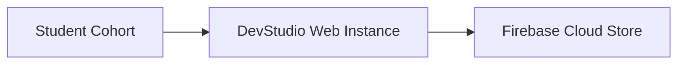
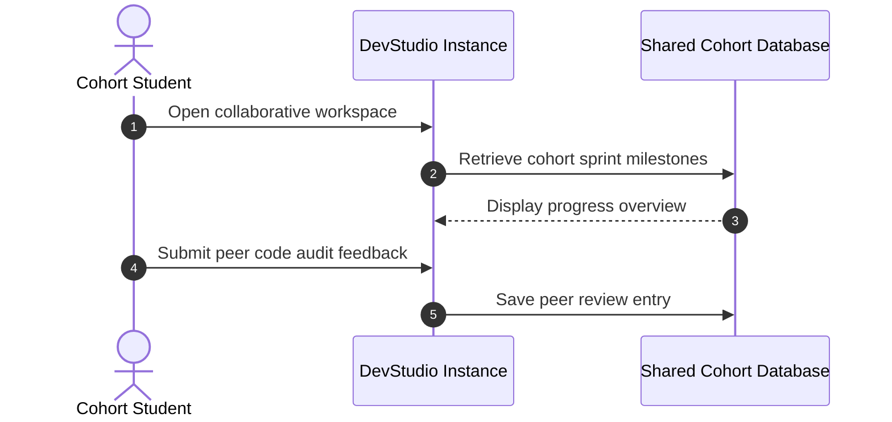

# DevStudio Instance — Collaborative Mentorship Workspace
[]()
[]()
[]()
[]()

## Overview
A collaborative fork and deployment branch of the DevStudio technical mentorship and career simulation platform. Configured for shared engineering workspaces, peer code audits, and curriculum milestone synchronization.

- **Problem Solved:** Multi-team collaboration on technical mentorship tracks.
- **Target Users:** Mentorship cohorts, university study circles, and peer evaluators.
- **Current Status:** Collaborative Branch Instance.

## Features
- **Curriculum Milestone Sync:** Shared project tracking across student cohorts.
- **Code Review Exchange:** Peer-to-peer technical evaluation and feedback forms.
- **Firebase Auth Integration:** Cohort member sign-in and session management.

## Architecture


## User Flow


## Technology Stack
| Layer | Technology | Purpose |
|---|---|---|
| Framework | Next.js 15 | React full-stack application runtime |
| Language | TypeScript | Domain type contracts |
| UI | Tailwind CSS | Component design system |
| Backend | Firebase | Database and authentication |

## Infrastructure
- **Server Port:** 3000
- **Cloud Backend:** Firebase

## Project Structure
```text
studio-1/
├── src/                 # Application code
├── package.json         # Dependencies
├── .gitignore           # Git ignore rules
└── README.md            # Technical documentation
```

## Prerequisites
- Node.js >= 18.x
- Firebase Project

## Environment Variables
Create `.env.local` using placeholders:
```env
NEXT_PUBLIC_FIREBASE_API_KEY=your_firebase_api_key
NEXT_PUBLIC_FIREBASE_PROJECT_ID=your_firebase_project_id
```

## Local Development Setup
```bash
git clone https://github.com/Bhanutejanallamothu/studio-1.git
cd studio-1
npm install
npm run dev
```

## Docker Setup
*Not detected in repository.*

## Database Setup
Firestore NoSQL database.

## API Documentation
Internal Next.js server actions.

## Deployment
Deploy to Vercel.

## Security
- Externalized environment variables.

## Testing
```bash
npm run lint
```

## Troubleshooting
- Check Firebase console configuration if auth fails.

## Future Improvements
- Automated GitHub repo milestone integration.

## License
All rights reserved by repository owner.
